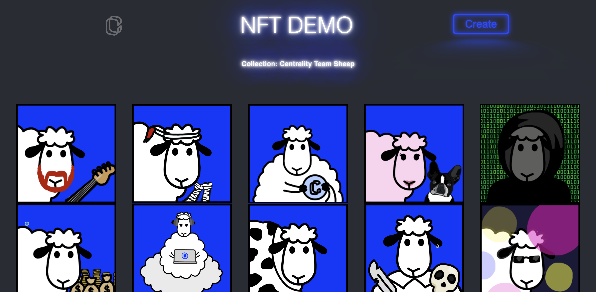

# NFT Demo

This project is a UI Demo for the NFT capabilities available on Cennznet.

## Overview

This app connects to one of our public blockchains currently the development network `rata`
which has a NFT collection and tokens minted on it already.

It uses our open source [API](https://github.com/cennznet/api.js) to connect, query, and make transactions (Extrinsics) on the blockchain.
It is querying the NFT collection name `Centrality Team Sheep` and collection id `0` and retrieving the NFT tokens and all associated metadata from that collection and presenting these details in the UI.

The app can also mint tokens within the given collection via the `Create` button. In this example we have a collection that has two properties that we've defined when creating the collection. 
The first is a `name` property which is defined as any string, and the second is the `url` which is image url link. The images are stored on IPFS which is an open sourced p2p file storage protocol
and that endpoint can be provided for the minting process.

This demo only scratches the surface on our NFT capabilities, and there are of many more options such royality schemes, auctioning, creating collections, creating series, and creating a variety of property types,
which you can explore via our API or though the [cennznet.io](https://cennznet.io/#/) by connecting to the nft module more details on that on our [wiki](https://wiki.cennz.net/#/References/Runtime-modules/NFT). 

## Setup

There are a couple steps required for installation:

- Ensure you have [Node js](https://nodejs.org/en/) and [yarn](https://classic.yarnpkg.com/en/docs/install/#mac-stable) installed
- Run `yarn` to install dependencies
- _Optional_ - Install the [Cennznet Browser Extension](https://chrome.google.com/webstore/detail/cennznet-extension/feckpephlmdcjnpoclagmaogngeffafk?hl=en) for managing transactions between Dapps & accounts. Only required if you want to connect to your wallet via the browser extension and not via Keyring. The App supports both options.
- Simply run `yarn start` to launch the app
- Connect to `localhost:3000` on a browser to view the demo

## Resources

- [NFT WIKI](https://wiki.cennz.net/#/Dapp-development/Guides/How-to-design-NFTs)
- [NFT Storage](https://nft.storage/)
- [IPFS](https://en.wikipedia.org/wiki/InterPlanetary_File_System)
  
